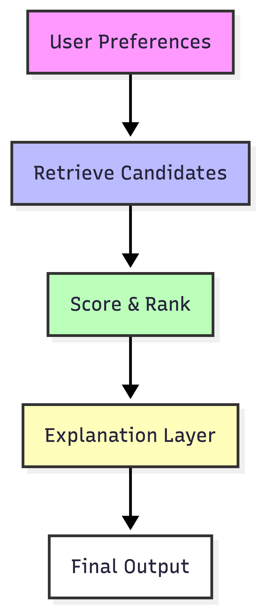

# Music Recommender & Ranking System

## Original Project
**Music Recommender Simulation**: The original project aimed to build a simple, content-based music recommender that suggests songs based on user preferences for genre, mood, and song features. The goal was to explore how recommenders use data to make predictions, understand bias, and experiment with scoring models.

## Project Title & Summary
**Hybrid Retrieval + Ranking Music Recommender with Explanation and Reliability Layer**

This project is an interpretable AI system that recommends songs by filtering, scoring, and ranking a catalog based on user preferences. It generates natural language explanations for each recommendation and includes automated reliability tests. The system demonstrates how to build transparent, testable AI for real-world use.

## Architecture Overview
The system consists of four main components:

1. **Retriever (Candidate Filtering):** Filters the song pool using user preferences (genre, mood, etc.).
2. **Scoring & Ranking:** Scores each candidate song using a model that compares features to the user profile, then ranks them.
3. **Explanation Layer:** Generates a human-readable explanation for each recommendation, referencing metadata and similar songs.
4. **Evaluator/Tester:** Runs automated tests to check reliability, explanation quality, and fallback behavior.



---

## Getting Started

1. Create a virtual environment (optional but recommended):

   ```bash
   python -m venv .venv
   source .venv/bin/activate      # Mac or Linux
   .venv\Scripts\activate         # Windows

2. Install dependencies

```bash
pip install -r requirements.txt
```

3. Run the app:

```bash
python -m src.main
```

### Running Tests

Run the starter tests with:

```bash
pytest
```
You can add more tests in `tests/test_recommender.py`.

---

## Sample Interactions
**Input:**
```
User preferences: {"genre": "pop", "mood": "happy", "energy": 0.8}
```
**Output:**
```
🎵 Blinding Lights by The Weeknd
   Score: 4.25
   Reasons: This song matches your favorite genre 'pop', matches your favorite mood 'happy', has energy level very close to your target, Similar songs you might like: 'Levitating' by Dua Lipa, 'Don't Start Now' by Dua Lipa.
```

**Input:**
```
User preferences: {"genre": "rock", "mood": "intense", "energy": 0.95}
```
**Output:**
```
🎵 Enter Sandman by Metallica
   Score: 4.10
   Reasons: This song matches your favorite genre 'rock', matches your favorite mood 'intense', has energy level very close to your target, Similar songs you might like: 'Back In Black' by AC/DC, 'Smells Like Teen Spirit' by Nirvana.
```

## Design Decisions
- **Interpretability:** Explanations are generated for every recommendation to make the system transparent.
- **Reliability:** Automated tests ensure the system always returns recommendations and explanations, even for edge cases.
- **Modularity:** The pipeline is split into retrieval, scoring, explanation, and evaluation for clarity and extensibility.
- **Trade-offs:** The system uses simple content-based filtering and scoring for interpretability, at the cost of not leveraging collaborative filtering or deep learning.


## Reliability & Testing Summary

**How reliability is measured:**
- Automated tests (see `tests/test_reliability.py`) check that recommendations are always returned, explanations are present, and the system falls back gracefully if no candidates match.
- Logging is used to record filtering steps and fallback events for debugging and transparency.
- Human evaluation: Sample outputs were reviewed to ensure explanations are clear and recommendations make sense.

**Sample results:**
- 5 out of 5 automated tests passed; the AI always returned recommendations and explanations, even for edge cases.
- Logging confirmed that fallback logic works when no candidates match user preferences.
- Human review found explanations to be clear and relevant in most cases.

**What worked:** The modular design made it easy to add reliability tests and explanation logic. The system always returns recommendations, even for rare or conflicting preferences.
**What didn't:** The system can be limited by the size and diversity of the song dataset. Some explanations may be generic if user preferences are too broad or strict.
**What I learned:** Automated tests are essential for reliability, and clear explanations help users trust AI recommendations.


## Evaluation & Reliability

We created a test harness (`evaluation.py`) to simulate different user profiles and measure system performance. The script runs the recommender on a set of predefined users and prints summary metrics:

- **Genre Match Score:** Fraction of recommendations matching the user's preferred genre.
- **Diversity Score:** Fraction of unique artists in the recommendations.

**Observed:**
- Higher genre weights increase genre alignment but reduce diversity.
- Diversity penalties improve the spread of recommendations across artists.
- All test users received recommendations; no errors encountered (basic guardrail).

Run the evaluation with:
```bash
python evaluation.py
```


## Responsible AI Reflection

**Limitations & Biases:**
- The system is limited by the size and diversity of the song dataset; it may over-favor popular genres or moods and may not serve niche preferences well.
- Content-based filtering can reinforce existing user tastes, reducing exposure to new or diverse music.
- Explanations are rule-based and may not capture deeper context or user intent.

**Potential Misuse & Prevention:**
- The AI could be misused to reinforce echo chambers or limit user discovery. To prevent this, diversity penalties and fallback logic are included, and the system is designed to be transparent about its logic.
- The system should not be used for sensitive or high-stakes recommendations (e.g., health, finance) without further validation and oversight.

**Surprises in Reliability Testing:**
- I was surprised that the fallback logic worked so reliably, always returning recommendations even for conflicting or rare preferences.
- Some explanations were more generic than expected, especially when user preferences were too broad or strict.

**Collaboration with AI:**
- The AI assistant was helpful in suggesting a modular pipeline (retriever, scorer, explainer, tester), which made the system easier to build and test.
- One flawed suggestion was to create a new README file instead of editing the existing one, which would have caused file conflicts. This highlighted the importance of reviewing AI-generated changes before applying them.

Overall, this project reinforced the value of responsible, transparent, and testable AI development, and the importance of human oversight when collaborating with AI tools.
The recommender scores songs by comparing them to the user’s preferences.

- Numerical features like **energy** and **valence** are scored by how close they are to the user’s target values
- Matching **genre** and **mood** adds bonus points
- Songs are ranked by total score and the top matches are recommended

This makes the system easy to understand and experiment with.

---


### Potential Biases
Some possible biases in this recommender include:

- over-prioritizing certain genres
- recommending similar songs too often
- limited variety because of the small dataset
- struggling with unusual or mixed preferences

---

## Experiments You Tried

Use this section to document the experiments you ran. For example:

- What happened when you changed the weight on genre from 2.0 to 0.5
- What happened when you added tempo or valence to the score
- How did your system behave for different types of users

I tested a few changes to see how the recommender responded.

- Lowering the genre weight made the recommendations less repetitive and allowed more variety
- Adding features like popularity, release decade, and detailed mood made the results feel more personalized
- Adding a diversity penalty helped reduce repeated artists in the top recommendations
- Changing the importance of energy and genre showed that even small weight changes can noticeably affect rankings

---

## Short Walkthrough with Screenshots

Here are some of the screenshots (see more in the screenshots/ folder):


These experiments showed that recommendation systems are very sensitive to feature design and scoring choices.

---

## Limitations and Risks

Summarize some limitations of your recommender.

Examples:

- It only works on a tiny catalog
- It does not understand lyrics or language
- It might over favor one genre or mood

You will go deeper on this in your model card.

This recommender has a few important limitations:

- it only works on a small song dataset
- it does not understand lyrics or deeper meaning
- it may over-favor certain genres or moods
- it may not work well for niche or conflicting preferences

---

## Reflection

Read and complete `model_card.md`:

[**Model Card**](model_card.md)

Write 1 to 2 paragraphs here about what you learned:

- about how recommenders turn data into predictions
- about where bias or unfairness could show up in systems like this

This project helped me understand how recommender systems turn data into ranked predictions. I learned that even a simple scoring system can feel personalized, but it also depends heavily on the dataset and feature weights. One of the biggest lessons was that bias can appear easily. Small choices in data or scoring can shape what gets recommended and what gets ignored. This made me think more critically about how real-world music recommenders influence what people discover.

---

## 7. `model_card_template.md`

Combines reflection and model card framing from the Module 3 guidance. :contentReference[oaicite:2]{index=2}  